## 查找指令

#### find

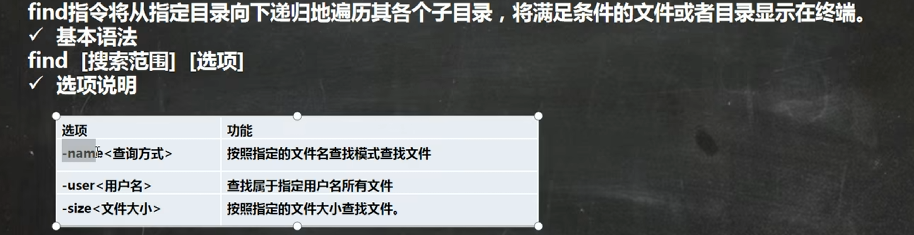

##### 应用实例

```bash
#案例1:按文件名:根据名称查找/home目录下的hello.txt文件
find /home -name hello.txt
#案例2:按拥有者:查找/opt目录下,用户名称为nobody的文件
find /opt -user nobody
#案例3:查找整个linux系统下大于200M的文件(+n大于-n小于 n等于,单位有k,M,G)
find / -size +200M
```

**找不到的文件不会显示**

#### locate

locate指令可以快速定位文件路径。locate指令利用事先建立的系统中所有文件名称及路径的locate数据库实现快速定位给定的文件。Locate指令无需遍历整个文件系统,查询速度较快。为了保证查询结果
的准确度,管理员必须定期更新locate时刻

##### 基本语法

locate 搜索文件

##### 特别说明

由于locate指令基于数据库进行查询,所以第一次运行前,必须使用updatedb指令创建locate数据库。

##### 应用实例

```bash
updatedb
locate hello.java#案例1:请使用locate指令快速定位 hello.txt 文件所在目录
#which可以查看某个指令在哪个目录下  which ls
```

#### grep和管道符号 |

grep过滤查找    ,管道符,   |     ,表示将前一个命令的处理结果输出传递给后面的命令处理。

##### 基本语法

grep [选项]  查找内容  源文件

##### 常用选项

-n     显示匹配行及行号。

-i       忽略字母大小写

##### 应用实例

```bash
cat -n /home/hello.txt | grep "yes" #案例1:请在hello.txt文件中,查找“yes"所在行,并且显示行号     （问题：自己写的时候无文件路径）
grep -n "yes" /home/hello.java  #法二
```


## 压缩和解压

#### gzip/gunzip 指令

gzip 用于压缩文件,gunzip用于解压的

##### 基本语法

gzip 文件      (功能描述:压缩文件,只能将文件压缩为 *- gz文件)
gunzip 文件·gz         (功能描述:解压缩文件命令)

##### 应用实例

```bash
#案例1:gzip压缩,将/home下的hello.txt文件进行压缩
gzip /home/hello.txt
#案例2:gunzip解压缩,将/home下的hello.txt.gz文件进行解压缩
gunzip /home/hello.txt.gz
```


#### zip/unzip 指令

zip 用于压缩文件,unzip用于解压的,这个在项目打包发布中很有用的

##### 基本语法

zip   [选项]   XXX.zip 将要压缩的内容  (功能描述:压缩文件和目录的命令)
unzip  [选项]  XXX.zip   (功能描述:解压缩文件)

解压和压缩都是zip

##### zip常用选项

-r:递归压缩,即压缩目录

##### unzip的常用选项

-d  <目录>:指定解压后文件的存放目录

##### 应用实例

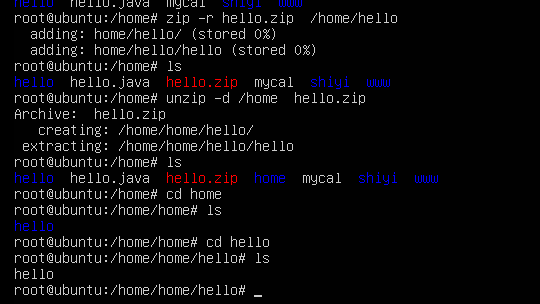

```bash
#案例1:将/home下的 所有文件进行压缩成 myhome.zip
zip -r myhome.zip /home/*#(*可有可无但都表示home及其下面的文件夹全部压缩)         别忘记-r
#案例2:将myhome.zip解压到/opt/tmp 目录下
uzip -d   /opt/tmp home/myhome.zip  
```

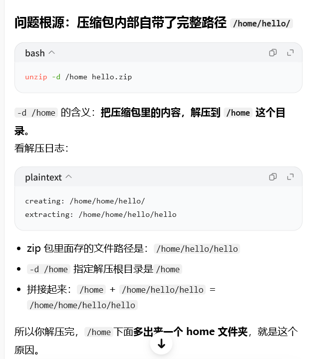

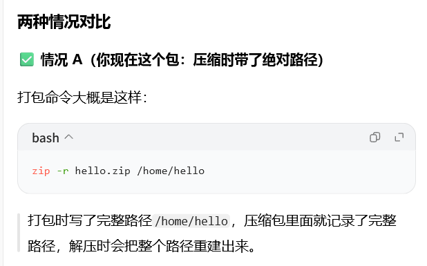

#### tar指令

tar 指令 是打包指令,最后打包后的文件是.tar.gz的文件。

##### 基本语法

tar[选项]XXX.tar.gz 打包的内容(功能描述:打包目录,压缩后的文件格式.tar.gz)
选项说明

##### 选项

-C    产生.tar打包文件
-v    显示详细信息
-f     指定压缩后的文件名
-z      打包同时压缩
-x      解包.tar文件

##### 应用实例

```bash
#案例1:压缩多个文件,将/home/pig.txt和/home/cat.txt 压缩成 pc.tar.gz
tar -zcvf pc.tar.gz /home/pig.txt /home/cat.txt
#案例2:将/home的文件夹 压缩成 myhome.tar.gz
tar -zcvf myhome.tar.gz /home/
#案例3:将pc.tar.gz 解压到当前目录
tar -zxvf pc.tar.gz
#案例4:将myhome.tar.gz 解压到/opt/tmp2目录下(1) mkdir/opt/tmp2(2)tar-zxvf/home/myhome.tar.gz-C /opt/tmp2
```


## Linux组基本介绍

在linux中的每个用户必须属于一个组,不能独立于组外。在linux中每个文件有所有者、所在组、其它组的概念。

所有者，创建文件的用户
所在组，创建文件的用户所在组
其它组，所在组之外的组
改变用户所在的组

#### 所有者

一般为文件的创建者,谁创建了该文件,就自然的成为该文件的所有者。

##### 查看文件的所有者

指令:Is   -ahl

##### 修改文件所有者

指令:chown  用户名 文件名

##### 应用案例

```bash
#要求:使用root创建一个文件apple.txt,然后将其所有者修改成 tom
touch apple.txt
chown tom apple.txt
```

#### 文件/目录所在组

当某个用户创建了一个文件后,这个文件的所在组就是该用户所在的组。

##### 查看文件/目录所在组

###### 基本指令

Is -ahl

###### 应用实例

使用fox（用户）创造文件，看看文件属于哪个组

```bash
ll
#得到以下
-rw-r--r--. 1 fox monster 0 11月 5 12:50 ok.txt
```


#####  修改文件/目录所在的组

###### 基本指令

chgrp  组名 文件名

######  应用实例

```bash
#使用root用户创建文件 orange.txt,看看当前这个文件属于哪个组,然后将这个文件所在组,修改到fruit组.
groupadd fruit
touch orange.txt
ll
chgrp fruit orange.txt
```

##### 回顾

###### 基本指令

groupadd 组名

###### 应用实例

```bash
#创建一个组,monster
groupadd monster
#创建一个用户 fox，并放入monster组中
useradd -g monster fox
```

#### 其他组

除文件的所有者和所在组的用户外,系统的其它用户都是文件的其它组

#### 改变用户所在组

在添加用户时,可以指定将该用户添加到哪个组中,同样的用root的管理权限可以改变某个用户所在的组。

##### · 改变用户所在组

1. usermod   -g  组名 用户名
2. usermod    -d  目录名 用户名  改变用户登陆的初始目录

**用户有进入新目录的权限**

##### · 应用实例

```bash
#将zwj这个用户从原来所在组,修改到wudang组。
id zwj                      
cat /etc/group |grep wudang   #查找在不在
usermod -g wudang zwj
```


## 权限

Is -l中显示的内容如下:
-rwxrw-r-- 1 root root 1213 Feb 2 09:39 abc

```bash
rwx：文件所有者对文件拥有的权限 r-root  w-write  x
rw：用户组的权限
r：其他组的权限
```

#### 0-9位说明

1. 第0位确定文件类型（d,-,l,c,b）

​       l是链接,相当于windows的快捷方式

​       d是目录,相当于windows的文件夹

​      c是字符设备文件,鼠标,键盘

​       b是块设备,比如硬盘

​       -是普通文件

2. 第1-3位确定所有者(该文件的所有者)拥有该文件的权限。 --- User
3. 第4-6位确定所属组(同用户组的)拥有该文件的权限, --- Group
4. 第7-9位确定其他用户拥有该文件的权限 --- Other

#### rwx权限详解

●rwx作用到文件

1. [r]代表可读(read):可以读取,查看
2. [w]代表可写(write):可以修改,但是不代表可以删除该文件,删除一个文件的前提条件是对该文件所在的目录有写权限,才能删除该文件.
3. [x]代表可执行(execute):可以被执行

●rwx作用到目录

  1.[r]代表可读(read):可以读取,Is查看目录内容

  2.[w]代表可写(write):可以修改,对目录内创建+删除+重命名目录

  3.[x]代表可执行(execute):可以进入该目录

#### 文件及目录权限实际案例

●ls -l 中显示的内容如下:
-rwxrw-r -- 1 root root 1213 Feb 2 09:39 abc

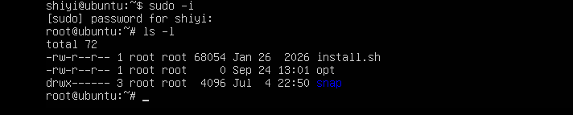

#####  10个字符确定不同用户能对文件干什么

第一个字符代表文件类型 :-  I d c b
其余字符每3个一组(rwx)读(r)写(w)执行(x)
第一组rwx:文件拥有者的权限是读、写和执行
第二组rw -: 与文件拥有者同一组的用户的权限是读、写但不能执行
第三组r --: 不与文件拥有者同组的其他用户的权限是读不能写和执行

 可用数字表示为:r=4,w=2,x=1因此rwx=4+2+1=7

##### 其它说明

1                           文件：硬连接数或 目录：子目录数

root                      用户

root                      组

1213                     文件大小（字节），（文件夹显示4096字节）

Feb 2 09：39       最后修改日期

abc                         文件名

#### 修改权限-chmod

##### 第一种 + - =变更权限

u：所有者  g：所在组  o：其他人 a：所有人（u,g,o总和）

1）chmod   u=rwx,g=rx,o=x   文件/目录名

2）chmod   o+w   文件/目录名

3）chmod   a-x      文件/目录名

###### 案例演示

```bash
#1)给abc文件 的所有者读写执行的权限,给所在组读执行权限,给其它组读执行权限。
chmod u=rwx,g=rx,o=rx  abc #别忘了文件名/目录名啊
#2)给abc文件的所有者除去执行的权限,增加组写的权限
chmod u-x,g+w  abc
#3)给abc文件的所有用户添加读的权限
chmod  a+r   abc
```

（绿色：可执行，蓝色：目录 ，红色：压缩文件）

##### 第二种 数字变更权限

r=4 w=2 x=1       （1-7分别代表不同的组合）

chmod u=rwx,g=rx,o=x 文件目录名  相当于 chmod 751 文件目录名

######  案例演示

```bash
要求:将/home/abc.txt 文件的权限修改成 rwxr-xr-x,使用给数字的方式实现:
chmod 755 /home/abc.txt
#rwx=4+2+1=7  r-x=1+4=5
```

#### 修改文件所有者chown

chown newowner 文件/目录                                     改变所有者
chown newowner:newgroup 文件/目录                 改变所有者和所在组
**-R 如果是目录 则使其下所有子文件或目录递归生效**

######  案例演示

```bash
#请将/home/abc.txt 文件的所有者修改成tom
chown tom /home/abc.txt
#请将/home/kkk 目录下所有的文件和目录的所有者都修改成tom
chown -R tom:tom /home/kkk      #(注意目录要  -R  )
```

#### 修改文件/目录所在组-chgrp

chgrp newgroup 文件/目录                       改变所在组

###### 案例演示

```bash
#请将/home/abc.txt  文件的所在组修改成shaolin(少林)
chgrp shaolin /home/abc.txt
#请将/home/kkk 目录下所有的文件和目录的所在组都修改成shaolin(少林)
chgrp -R shaolin /home/kkk
```

### 实践

#### 土匪与警察

police , bandit
jack, jerry:警察
xh,xq:土匪

1. 创建组 groupadd police;groupadd banidit

2. 创建用户（**要设置密码的，不设，普通用户无法切换到它**）
    useradd -m -g police jack ; useradd -m -g police jerry
    useradd -m -g bandit xh; useradd -m -g bandit xq

3. jack创建一个文件,自己可以读r写w,本组人可以读,其它组没人任何权限
    首先jack登录  ; 

  **cd /home/jack里创建jack.txt与登陆进去jack创建文件是不一样的，这个首先错了**

   vim jack.txt                    chmod 640 jack.txt

4. jack修改该文件,让其它组人可以读,本组人可以读写
    chmod g=rw,o=r  jack.txt

  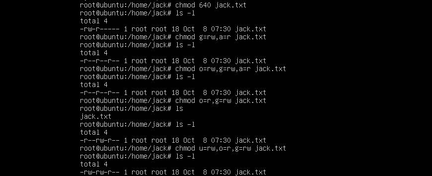

   **u是所有者，o是其他组；后面覆盖前面，所以a=r使ugo都只读了**

  （在root，❌）

5. xh 投靠 警察,看看是否可以读写.
    usermod -g police xh（回root）

6. 测试,看看xh是否可以读写,xq是否可以,小结论,就是如果要对目录内的文件进行操作,需要有对该目录的相应权限

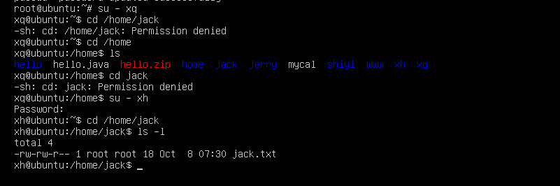

xq无法访问，xh可以读写（在root创建的，❌）

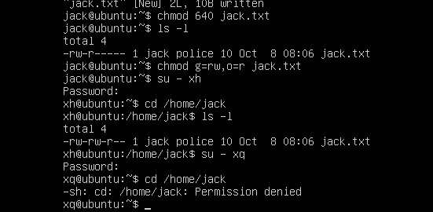

✔

为什么xq访问不进去


##### 注意

1.cd /home/jack  跟登录jack创建文件不同，用户和组别分别是 root  root  与  jack  police

2.xh@ubuntu:jack$         xh：用户    jack：目录

#### 西游记

1. 建立两个组(神仙(sx),妖怪(yg))
2. 建立四个用户(唐僧,悟空,八戒,沙僧)
3. 设置密码
4. 把悟空,八戒放入妖怪 唐僧 沙僧 在神仙

5. 用悟空建立一个文件(monkey.java 该文件要输出i am monkey)
6. 给八戒一个可以rw的权限
7. 八戒修改monkey.java 加入一句话(i am pig)

8. 唐僧 沙僧 对该文件没有权限
9. 把沙僧 放入妖怪组
10. 让沙僧 修改 该文件monkey,加入一句话(“我是沙僧,我是妖怪!”);

```bash
root:groupadd sx      groupadd yg
     useradd -m  ts/ss/wk/bj
     passwd ts / wk / bj /ss
     usermod -g sx ts/ss
     usermod -g yg wk/bj
su - wk
wk: vim monkey.java    monkey.java: i am a monkey
    ls -l
    chmod  g=rw/g+w monkey.java
    chmod  g+r+w+x  /home/wk #新增，给八戒加进入文件夹权限
bj: cd /home/wk    #(ls -l)
    vim monkey.java  
#chmod 8.无操作
root:usermod -g yg ss  #自己写忘了-g
ss:cd /home/monkey.java     vim monkey.java  
```

11.对文件夹rwx的细节讨论和测试

x:表示可以进入到该目录,比如cd
r:表示可以Is,将目录的内容显示
w:表示可以在该目录,删除或者创建文件


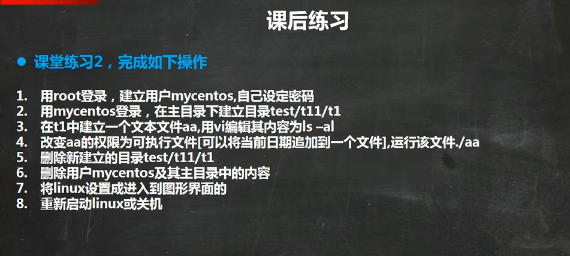

### ubuntu纯命令行开多个终端

1.ctrl +alt+F1    ctrl +alt+F2（tty2）    ctrl +alt+F3（tty3）

2.tmux（同一个屏幕中分屏，常用来进行测试）

- 安装：sudo apt install tmux
- 输入tmux进入tmux环境

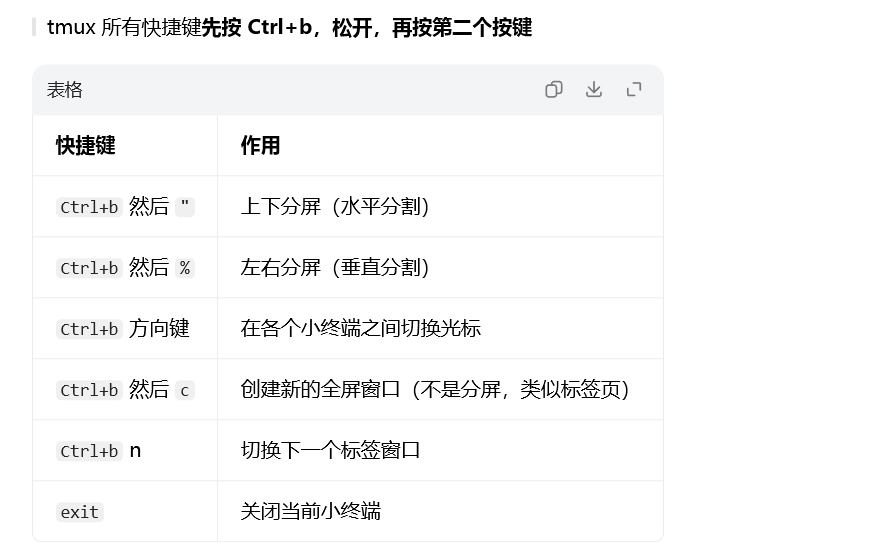

## crond任务调度

crontab 进行 定时任务的设置

### 快速入门

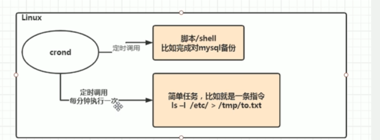

##### 概述

任务调度:是指系统在某个时间执行的特定的命令或程序。
任务调度分类:1.系统工作:有些重要的工作必须周而复始地执行。如病毒扫描等
个别用户工作:个别用户可能希望执行某些程序,比如对mysql数据库的备份。

##### 基本语法

crontab  [选项]

##### 常用选项

-e  编辑crontab定时任务

-l   查询crontab任务

-r  删除当前用户所有的crontab任务

#####  快速入门

设置任务调度文件:     /etc/crontab
设置个人任务调度。执行  crontab-e  命令。
接着输入任务到调度文件
·如 :* /1 *  *  *  * Is-l /etc/ > /tmp/to.txt

​       分   时日月星期

意思说每小时的每分钟执行Is-l/etc/>/tmp/to.txt命令

#####  参数细节说明

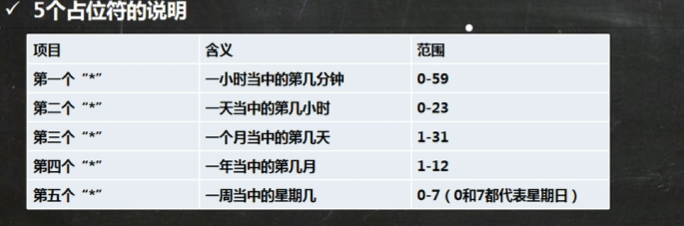

### 时间规则

| 特殊符号 | 含义                                                         |
| -------- | :----------------------------------------------------------- |
| *        | 代表任何时间,比如第一个“*”就代表一小时中每分钟都执行一次的意思。 |
| ‘        | 代表不连续的时间,比如“08,12,16 *** 命令”,就代表在每天的8点0分,12点0分,16点0分都执行一次命令 |
| -        | 代表连续的时间范围,比如“05 ** 1-6命令”,代表在周一到周六的凌晨5点0分执行命令 |
| */n      | 代表每隔多久执行一次,比如“*/10 * * * *命令“代表每隔10分钟执行一次 |

#### 注意

星期几和几号最好不要同时出现                    

### 应用实例

```bash
#案例1:每隔1分钟,就将当前的日期信息,追加到/tmp/mydate文件中
*/1 * * * * date >> /tmp/mydate
#案例2:每隔1分钟,将当前日期和日历都追加到/home/mycal文件中
#步骤:
#(1)vim/home/my.sh 写入内容 
date > >/home/mycal        cal> >/home/mycal
#(2)给my.sh 增加执行权限，
chmod u+x /home/my.sh
#(3)
crontab-e    */1**** /home/my.sh
#案例3:每天凌晨2:00将mysql数据库testdb,备份到文件中。提示:指令为mysqldump-u root-p密码 数据库> >/home/db.bak
crontab-e
0 2 *** mysqldump-u root-proot testdb > >/home/db.bak
```

#### crond 相关指令

 conrtab-r:  终止任务调度。

 crontab-I:  列出当前有哪些任务调度

service crond restart   [重启任务调度]


## at定时任务

### 基本介绍

1. at命令是一次性定时计划任务,at的守护进程atd会以后台模式运行,检查作业队列来运行。
2. 默认情况下,atd守护进程每60秒检查作业队列,有作业时,会检查作业运行时间,如果时间与当前时间匹配,则运行此作业。
3. at命令是一次性定时计划任务,执行完一个任务后不再执行此任务了
4. 在使用at命令的时候,一定要保证atd进程的启动,可以使用相关指令来查看

​     ps -ef (检测正在运行的进程有哪些)

### at命令格式

at [ 选项 ] [时间]
Ctrl+D 结束at命令的输入
